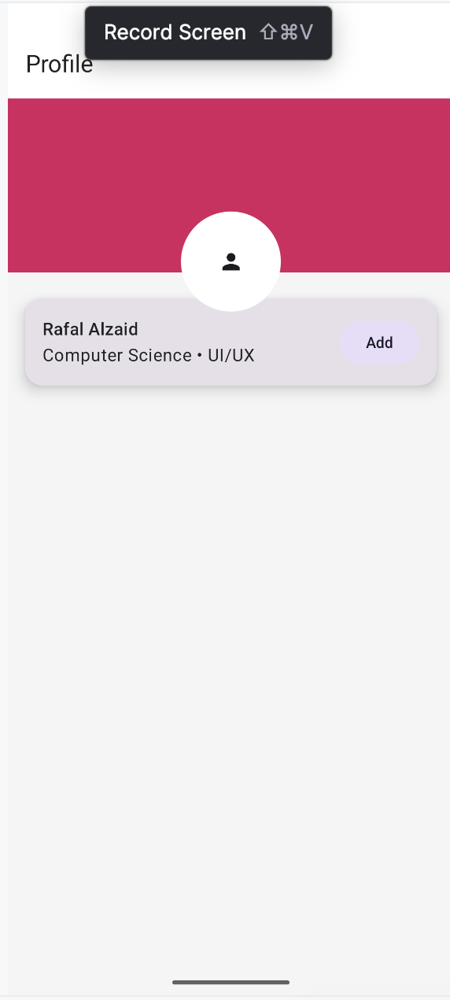

# Individual Assignment 3 – Q2 Profile Header

## Features
1. Box used as the main layout container for layered UI
2. Background header section with solid color
3. Circular avatar displayed in the foreground using clip(CircleShape)
4. Overlay Card that partially overlaps the header
5. Intentional use of alignment and offset for visual structure

## Material 3 Components
1. Card
2. TopAppBar
3. Icon
4. FilledTonalButton
5. Scaffold

### AI Dsclosure
This assignment was much simpler than Q1 and required minimal troubleshooting; therefore, ChatGPT was used to help maintain visual and structural consistency between assignments, particularly for color usage and layout patterns, and the README. 
